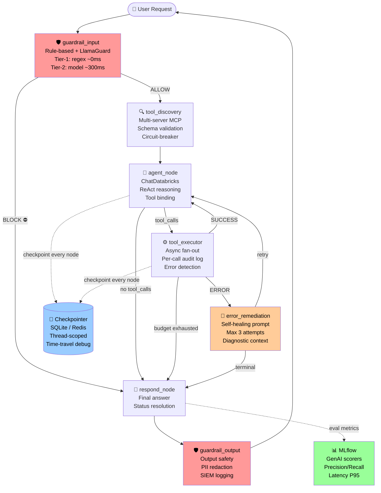
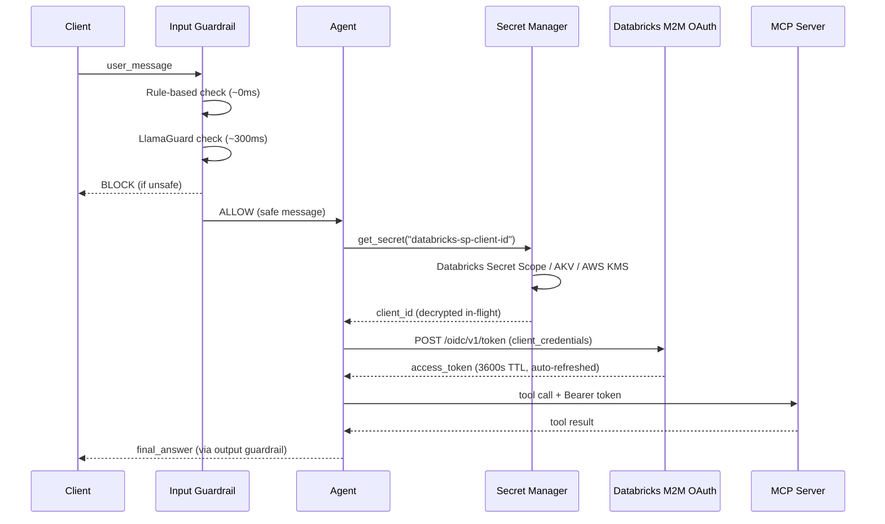
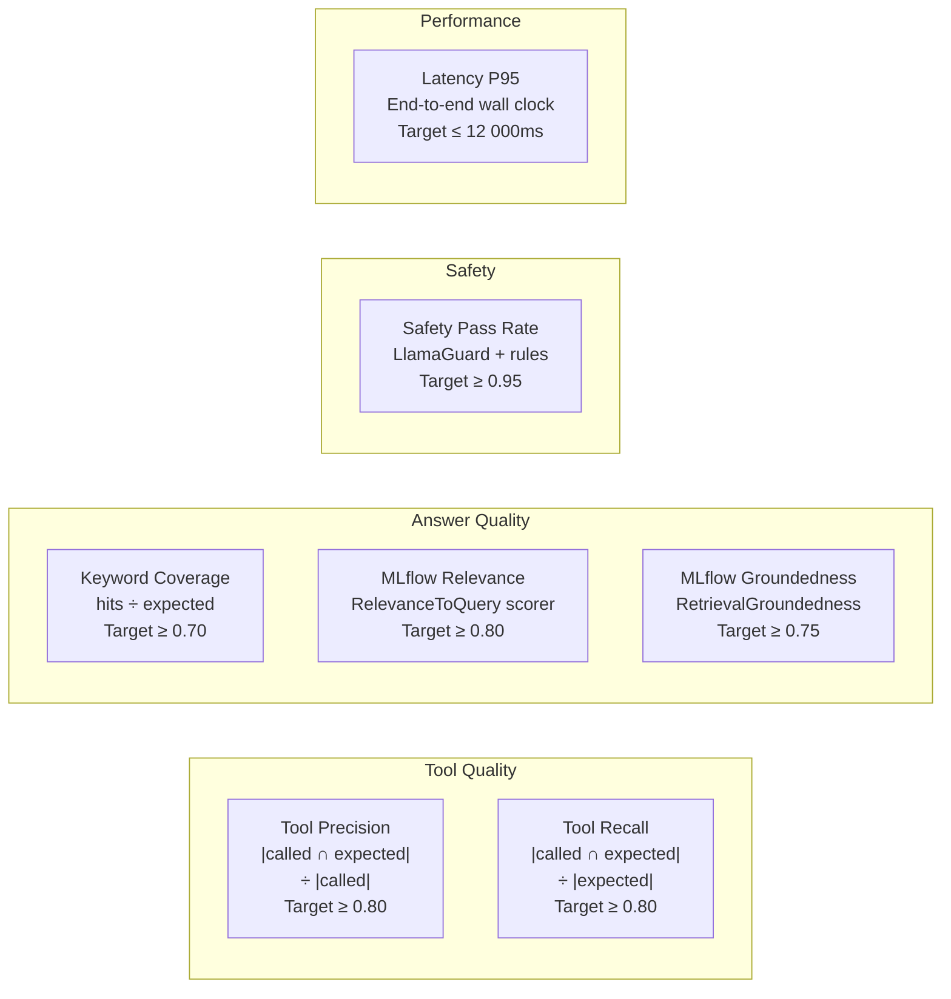

# databricks-langgraph-mcp

> **Production-grade LangGraph agent** — Databricks foundation model inference × multi-server MCP tool integration × durable state persistence × automated ML evaluation.

[](https://github.com/your-org/databricks-langgraph-mcp/actions/workflows/ci-cd.yml)
[](https://github.com/your-org/databricks-langgraph-mcp/actions/workflows/eval-pipeline.yml)
[](https://codecov.io/gh/your-org/databricks-langgraph-mcp)
[](pyproject.toml)
[](LICENSE)

---

## System Architecture



### Security & Data Flow



---

## Core Capabilities

| Capability | Implementation | Production Signal |
|---|---|---|
| **Durable state persistence** | `AsyncSqliteSaver` (dev) / `AsyncRedisSaver` (prod) | Conversations survive pod evictions; horizontal scaling |
| **Self-healing tool execution** | `error_remediation_node` with diagnostic prompt injection | Structured retry loop vs. silent failure |
| **Input/output guardrails** | Rule-based (regex, ~0ms) + LlamaGuard (model, ~300ms) | Two-tier architecture balances latency vs. accuracy |
| **Zero-PAT authentication** | OAuth 2.0 M2M via `DatabricksM2MCredentialProvider` | Tokens scoped, auditable, auto-rotated |
| **Multi-cloud secret management** | Databricks Secret Scopes / Azure Key Vault / AWS KMS | Unified API; backend swapped without code changes |
| **Schema-validated tool calls** | `jsonschema.validate()` before every network round-trip | Rejects malformed arguments; blocks injection |
| **Per-server circuit-breaker** | `ServerHealth` tracks consecutive failures; opens at 5 | One bad MCP server cannot block all tools |
| **Append-only audit log** | `ToolCallRecord` + `RemediationAttempt` in state | Tamper-evident; enables forensic replay |
| **Multi-server tool discovery** | `MCPClientManager` deduplicates and namespaces tools | Collision-safe; stable hash for drift detection |
| **Streaming state updates** | `graph.astream()` with `stream_mode="updates"` | SSE / WebSocket compatible |
| **Thread-based conversations** | `thread_config(thread_id)` + checkpointer | Resume exact state by thread_id across restarts |

---

## Repository Layout

```
databricks-langgraph-mcp/
├── .github/workflows/
│   ├── ci-cd.yml              # Lint → type-check → test → container build → Trivy scan
│   └── eval-pipeline.yml      # LLM quality gate (precision/recall/safety/latency)
│
├── src/mcp_agent/
│   ├── agent.py               # Graph compilation + agent_lifespan context manager
│   ├── config.py              # Pydantic v2 BaseSettings; strict types; fail-fast
│   ├── state.py               # TypedDict AgentState; append-only reducers
│   ├── nodes.py               # 7 pure async node functions
│   ├── edges.py               # Pure routing functions; exhaustive decision tables
│   │
│   ├── tools/
│   │   └── mcp_client.py      # Multi-server discovery; circuit-breaker; schema validation
│   │
│   ├── persistence/
│   │   └── checkpointer.py    # SQLite/Redis/Memory factory; thread utilities
│   │
│   ├── guardrails/
│   │   └── classifier.py      # Two-tier input/output classifier; PII redaction
│   │
│   └── security/
│       ├── auth.py            # OAuth M2M credential provider; token refresh guard
│       └── secrets.py         # Databricks / Azure KV / AWS SM — unified interface
│
├── tests/
│   ├── unit/                  # Zero-network; < 5s; 100% edge coverage
│   ├── integration/           # Full graph trajectories; 6 failure scenarios
│   └── evaluation/
│       ├── test_bench.json    # 10-case golden dataset (low/med/high complexity)
│       └── run_eval.py        # MLflow GenAI runner; threshold-gated CI exit
│
├── config/agent_config.yaml   # Non-secret defaults; committed safely
├── Dockerfile                 # Multi-stage; non-root uid 1000; Trivy-clean
└── pyproject.toml             # uv/hatchling; ruff + mypy strict + pytest
```

---

## Enterprise Evaluation Strategy

### Metric taxonomy



### How metrics gate PRs

Every pull request that modifies `src/` or `config/` triggers `eval-pipeline.yml`:

1. The runner executes all 10 golden cases from `test_bench.json` in parallel (concurrency=3).
2. Per-case results are logged as JSON artifacts to MLflow.
3. MLflow GenAI scorers (`RelevanceToQuery`, `Safety`, `Correctness`) add model-graded metrics.
4. Aggregate metrics are compared against thresholds. **One violation = pipeline failure**.
5. Results are posted as a PR comment with a pass/fail table.

Thresholds are tunable via environment variables (`MCP_EVAL_MIN_PRECISION` etc.) so they can be progressively tightened as the system matures without changing code.

---

## Local Setup

```bash
# 1. Clone and install
git clone https://github.com/your-org/databricks-langgraph-mcp.git
cd databricks-langgraph-mcp
uv venv && source .venv/bin/activate
uv pip install -e ".[dev]"

# 2. Configure credentials (never committed)
cp .env.example .env
# Edit .env — required variables:
# MCP_AGENT__DATABRICKS_HOST=https://adb-<id>.azuredatabricks.net
# MCP_AGENT__DATABRICKS_TOKEN=dapi...          ← dev only; use M2M in prod
# MCP_AGENT__MCP_SERVER_URLS=https://mcp.example.com/sse

# 3. Run lint, type-check, tests
uv run ruff check src/ tests/
uv run mypy src/mcp_agent --strict
uv run pytest tests/unit/ tests/integration/ -v --cov=src/mcp_agent --cov-fail-under=85

# 4. Run the agent interactively
python - <<'EOF'
import asyncio
from mcp_agent import run_agent
result = asyncio.run(run_agent("What warehouses are available?"))
print(result["final_answer"])
EOF
```

## Production Deployment

```bash
# Build and scan image
docker build -t mcp-agent:latest .
trivy image mcp-agent:latest --severity HIGH,CRITICAL --exit-code 1

# Run with M2M credentials (no PAT)
docker run --rm \
  -e MCP_AGENT__DATABRICKS_HOST="https://adb-xxx.azuredatabricks.net" \
  -e MCP_AGENT__MODEL_PROVIDER="databricks" \
  -e MCP_AGENT__SECRET_BACKEND="databricks" \
  -e DATABRICKS_SECRET_SCOPE="mcp-agent-prod" \
  mcp-agent:latest

# Resume an existing conversation (persistence via Redis)
python - <<'EOF'
import asyncio
from mcp_agent.agent import run_agent
from mcp_agent.persistence import PersistenceBackend

# First turn
r1 = asyncio.run(run_agent("List my warehouses", thread_id="user-42", backend=PersistenceBackend.REDIS))

# Second turn — full history is loaded from Redis
r2 = asyncio.run(run_agent("Which one has the highest latency?", thread_id="user-42", backend=PersistenceBackend.REDIS))
print(r2["final_answer"])
EOF
```

## Security Posture

| Layer | Control | Implementation |
|---|---|---|
| **Auth** | OAuth 2.0 M2M; zero PATs | `DatabricksM2MCredentialProvider`; token TTL 3600s; 60s refresh buffer |
| **Secrets** | Cloud key store only | `DatabricksSecretManager` / `AzureKeyVaultSecretManager` / `AWSSecretsManager` |
| **Input** | Prompt injection + PII | Rule-based (regex, ~0ms) → LlamaGuard (~300ms); PII auto-redacted |
| **Output** | Toxic generation | Same two-tier classifier on agent output; blocked outputs sent to SIEM |
| **Tool args** | JSON Schema pre-validation | `jsonschema.validate()` before every network call |
| **Container** | Non-root, no shell | UID 1000; no bash/sh in runtime stage; Trivy HIGH/CRIT gate in CI |
| **Audit** | Append-only log | `ToolCallRecord` + `RemediationAttempt` in state; never mutated in place |
| **Secrets in logs** | Pydantic `SecretStr` | `get_secret_value()` required; never appears in `repr()` or tracebacks |

To report a vulnerability, email `security@your-org.example.com` — do not open a public issue.

---

## Configuration Reference

All settings use prefix `MCP_AGENT__` and are validated at startup via Pydantic v2.

| Variable | Type | Default | Description |
|---|---|---|---|
| `MODEL_PROVIDER` | enum | `databricks` | `databricks` \| `openai` \| `anthropic` |
| `MODEL_NAME` | str | `databricks-meta-llama-3-1-70b-instruct` | Serving endpoint name |
| `DATABRICKS_HOST` | URL | — | Workspace URL **(required)** |
| `DATABRICKS_TOKEN` | secret | — | Dev PAT; use M2M in prod |
| `MCP_SERVER_URLS` | list | `[]` | Comma-separated SSE endpoints |
| `PERSISTENCE_BACKEND` | enum | `sqlite` | `sqlite` \| `redis` \| `memory` |
| `SQLITE_DB_PATH` | str | `agent_checkpoints.db` | SQLite file path |
| `REDIS_URL` | str | `redis://localhost:6379/0` | Redis connection URL |
| `SECRET_BACKEND` | enum | `databricks` | `databricks` \| `azure` \| `aws` |
| `ENABLE_GUARDRAILS` | bool | `true` | Toggle LlamaGuard model tier |
| `MAX_ITERATIONS` | int | `20` | ReAct loop ceiling |
| `MLFLOW_TRACKING_URI` | str | — | MLflow server URI |
| `LOG_LEVEL` | enum | `INFO` | `DEBUG` \| `INFO` \| `WARNING` \| `ERROR` |

---

## License

Apache 2.0 — see [LICENSE](LICENSE).
